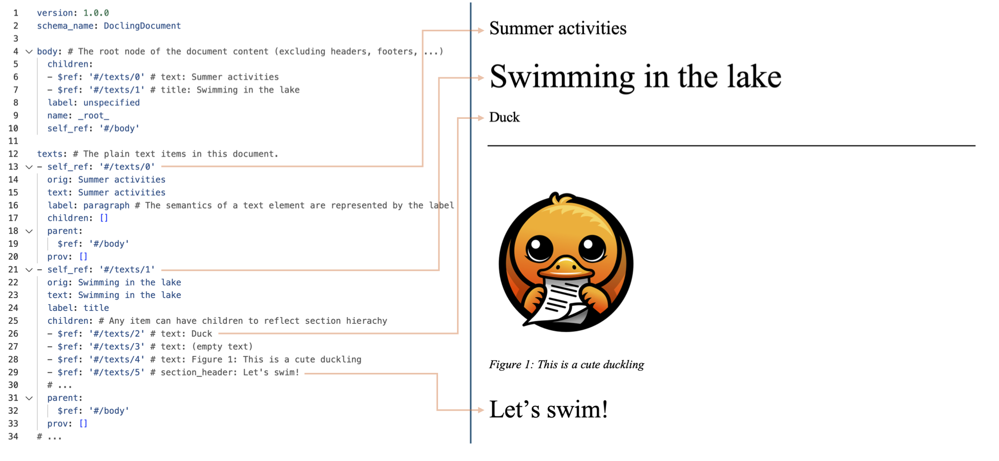
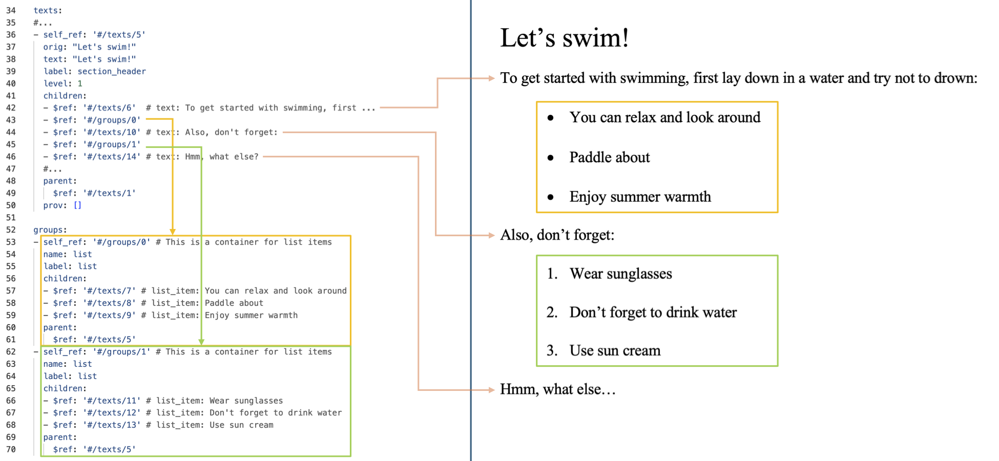

Docling v2에서는 `DoclingDocument`라는 통합 문서 표현 형식을 도입합니다. 이는 pydantic 데이터 타입으로 정의되며, 문서에 공통적으로 나타나는 여러 기능을 표현할 수 있습니다:

* 텍스트, 표, 그림 등
* 섹션과 그룹으로 구성된 문서 계층 구조
* 본문과 헤더, 푸터(furniture) 간의 구별
* 가능한 경우 모든 항목의 레이아웃 정보(바운딩 박스)
* 출처 정보

Pydantic 타입의 정의는 `docling_core.types.doc` 모듈에서 구현되며, 자세한 내용은 [소스 코드 정의](https://github.com/docling-project/docling-core/tree/main/docling_core/types/doc)에서 확인할 수 있습니다.

또한 `DoclingDocument`를 처음부터 구축하기 위한 문서 생성 API 세트도 제공합니다.

## 문서 구조 예시

`DoclingDocument` 형식의 기능을 설명하기 위해, 아래 하위 섹션에서는 `tests/data/word_sample.docx`에서 변환된 `DoclingDocument`를 고려하며, 좌측에는 YAML로 직렬화된 변환된 문서의 스니펫을, 우측에는 원본 MS Word의 해당 부분을 보여주는 나란히 비교를 제시합니다.

### 기본 구조

`DoclingDocument`는 두 범주로 구성된 문서 콘텐츠를 위한 최상위 필드들을 제공합니다.
첫 번째 범주는 다음 필드들에 저장되는 _콘텐츠 항목들_입니다:

- `texts`: 텍스트 표현을 가진 모든 항목들(단락, 섹션 제목, 수식 등). 기본 클래스는 `TextItem`입니다.
- `tables`: 모든 표, `TableItem` 타입. 구조 주석을 포함할 수 있습니다.
- `pictures`: 모든 그림, `PictureItem` 타입. 구조 주석을 포함할 수 있습니다.
- `key_value_items`: 모든 키-값 항목들.

위의 모든 필드들은 리스트이며 `DocItem` 타입을 상속받는 항목들을 저장합니다. 타입에 따라 다른 데이터 구조를 표현할 수 있으며, JSON 포인터를 통해 부모와 자식을 참조합니다.

두 번째 범주는 다음에 캡슐화된 _콘텐츠 구조_입니다:

- `body`: 메인 문서 본문을 위한 트리 구조의 루트 노드
- `furniture`: 본문에 속하지 않는 모든 항목들(헤더, 푸터 등)을 위한 트리 구조의 루트 노드
- `groups`: 콘텐츠를 나타내지 않지만 다른 콘텐츠 항목들의 컨테이너 역할을 하는 항목들의 집합(예: 목록, 챕터)

위의 모든 필드들은 JSON 포인터를 통해 자식과 부모를 참조하는 `NodeItem` 인스턴스만을 저장합니다.

문서의 읽기 순서는 `body` 트리와 트리의 각 항목에서 _자식들_의 순서를 통해 캡슐화됩니다.

아래 예시는 첫 번째 페이지의 모든 항목들이 `title` 항목(`#/texts/1`) 아래에 중첩되는 방식을 보여줍니다.

### 그룹화

아래 예시는 "Let's swim" 제목(`#/texts/5`) 아래의 모든 항목들이 자식으로 중첩되는 방식을 보여줍니다. "Let's swim"의 자식들은 텍스트 항목들과 목록 요소들을 포함하는 그룹들 모두입니다. 그룹 항목들은 최상위 `groups` 필드에 저장됩니다.

<!--
### Tables

TBD

### Pictures

TBD

### Provenance

TBD
 -->
