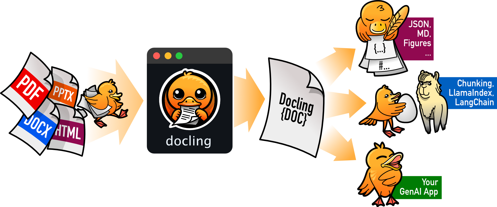

  
  

Docling은 고급 PDF 분석을 포함한 다양한 문서 형식을 파싱하여 문서 처리를 단순화하고, 생성형 AI 생태계와 원활하게 통합됩니다.

## 주요 기능

* 🗂️ PDF, DOCX, XLSX, HTML, 이미지 등 [다양한 문서 형식][supported_formats] 파싱
* 📑 페이지 레이아웃, 읽기 순서, 표 구조, 코드, 수식, 이미지 분류 등을 포함한 고급 PDF 분석 기능
* 🧬 통합적이고 표현력 있는 [DoclingDocument][docling_document] 표현 형식
* ↪️ Markdown, HTML, 무손실 JSON 등 다양한 [내보내기 형식][supported_formats] 및 옵션 지원
* 🔒 민감한 데이터와 폐쇄망 환경을 위한 로컬 실행 기능
* 🤖 LangChain, LlamaIndex, Crew AI, Haystack 등 에이전트 AI를 위한 플러그 앤 플레이 방식의 [통합][integrations] 기능
* 🔍 스캔된 PDF 및 이미지를 위한 폭넓은 OCR 지원
* 🥚 여러 비전 언어 모델([SmolDocling](https://huggingface.co/ds4sd/SmolDocling-256M-preview)) 지원 🔥
* 💻 간단하고 편리한 CLI

### 출시 예정

* 📝 제목, 저자, 참고문헌, 언어 등 메타데이터 추출
* 📝 차트 분석 (막대 차트, 원 그래프, 선 그래프 등)
* 📝 복잡한 화학 구조 분석 (분자 구조)

## 시작하기

  <a href="concepts/" class="card"><b>개념</b> Docling의 기본 개념 알아보기</a>
  <a href="examples/" class="card"><b>예제</b> 변환, RAG 등 다양한 사용 사례 레시피 살펴보기</a>
  <a href="integrations/" class="card"><b>통합</b> 주요 프레임워크 및 도구와의 통합 살펴보기</a>
  <a href="reference/document_converter/" class="card"><b>레퍼런스</b> API 상세 정보 확인하기</a>

## LF AI & Data

Docling은 [LF AI & Data Foundation](https://lfaidata.foundation/projects/)의 프로젝트로 호스팅됩니다.

### IBM ❤️ Open Source AI

이 프로젝트는 IBM Research Zurich의 AI for knowledge 팀에서 시작했습니다.

[supported_formats]: ./usage/supported_formats.md
[docling_document]: ./concepts/docling_document.md
[integrations]: ./integrations/index.md
